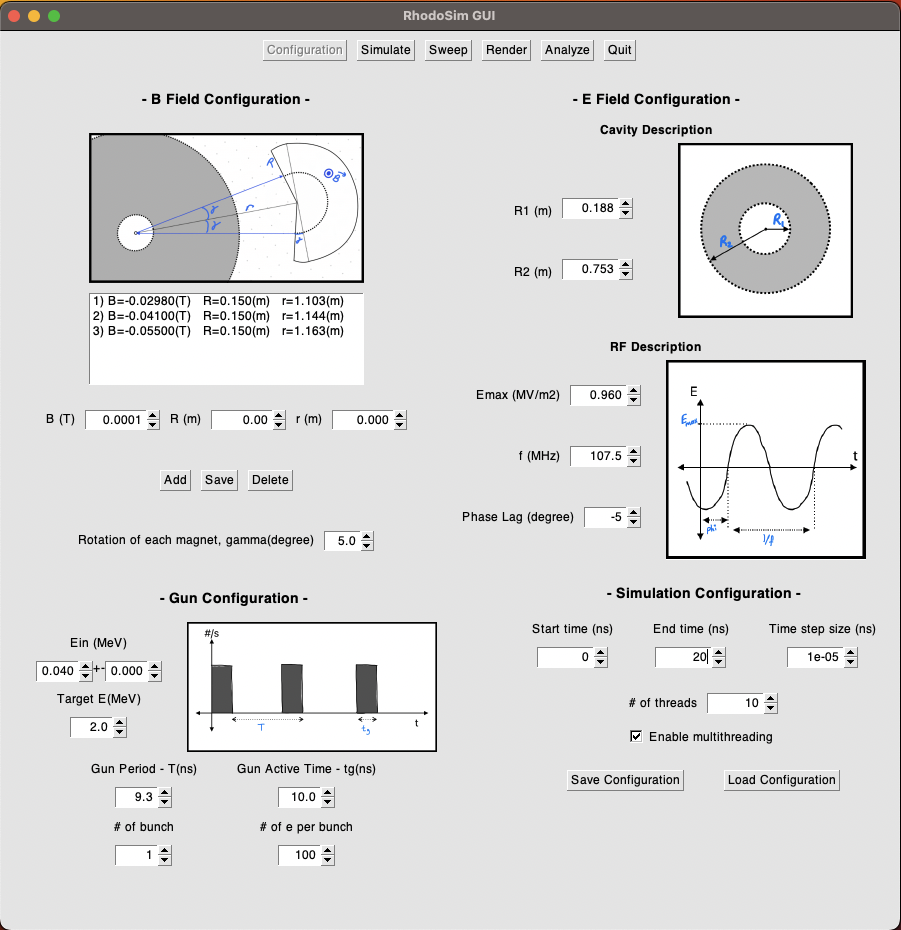
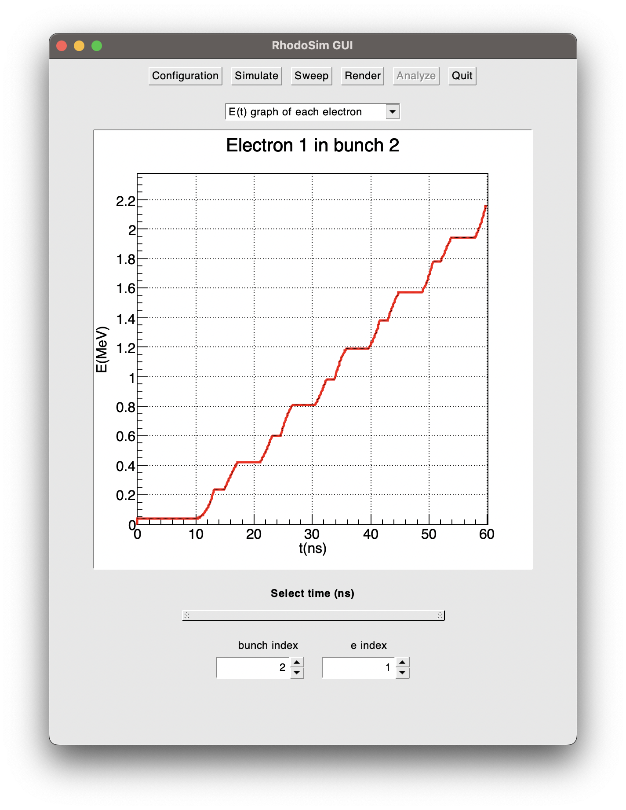
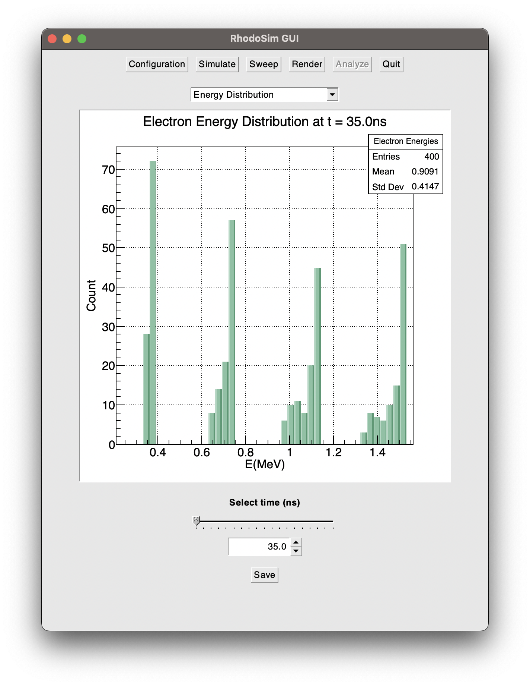
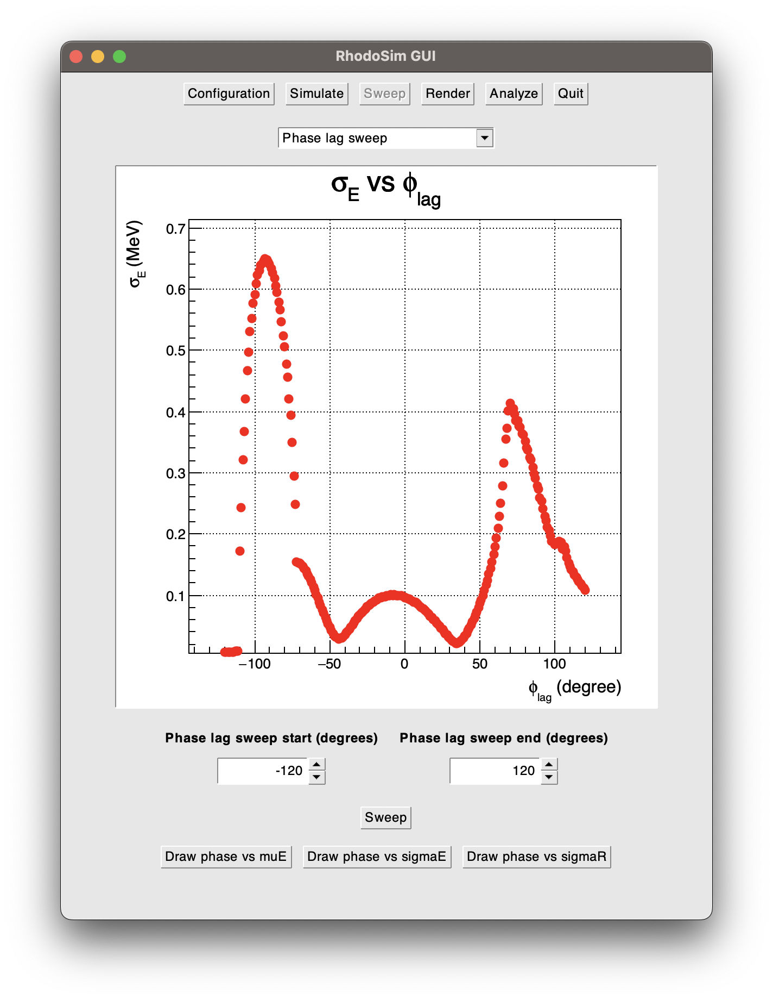
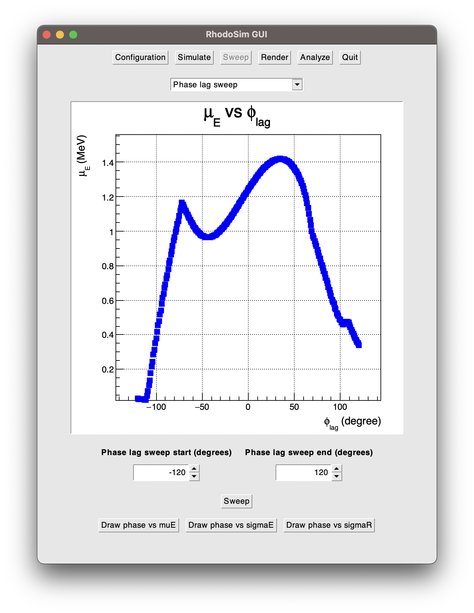

# RhodotronSimulation
    A General Purpose EM Simulation with Rhodotron Type Acceleration Focus 
 
 

# GUI render - Command line render
Example *unsynchronized* simulation renders for visual impression

  
   

# Config and Render frames of GUI

  
   

# E(t) - E histogram

  
   

# Phase Lag Sweep

  
   

